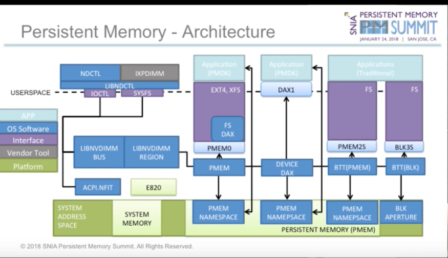

# IPMCTL User Guide

## Introduction

`ipmctl` is an open source utility created and maintained by Intel to manage Intel® Optane™ persistent memory modules. `ipmctl`, works on both Linux and Windows. The full project is open source and can be seen on [GitHub](https://github.com/intel/ipmctl). In this guide we will refer to Intel® Optane™ memory modules simply as _modules_ or _persistent memory modules_.

`ipmctl` refers to the following interface components:

* `libipmctl`: An Application Programming Interface (API) library for managing persistent memory modules.
* `ipmctl`: A Command Line Interface (CLI) application for configuring and managing persistent memory modules from the command line.
* `ipmctl-monitor`: A monitor daemon/system service for monitoring the health and status of persistent memory modules.

Functionality includes:

* Discover Intel Optane persistent memory modules on the platform
* Provision the platform memory configuration
  * Learn more about operating modes in this [video](https://www.youtube.com/watch?v=gqo3gty-R4s)
* View and update module firmware
* Configure data-at-rest security
* Monitor module health
* Track performance of modules
* Debug and troubleshoot modules

Architecture Diagram:

To learn more about how ipmctl works with the hardware see the [Intel® Optane™ Persistent Memory OS Provisioning Specification](https://cdrdv2.intel.com/v1/dl/getContent/634430), which describes all the firmware interface commands used for this operation.&#x20;
